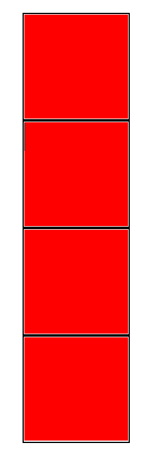
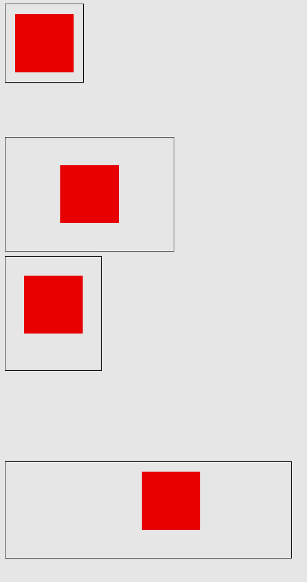

# Box Boxer

All of the world is boxes. It's boxes all the way down. At least on the web.

## Instructions

Start out by forking this repository. Once you're done, submit both the URL to the code as well as the URL to your project hosted on GitHub Pages.

Today, your goal is to make the boxes defined in the `div` CSS in `style.css` look like the screenshot in `goal.png`. You'll use `margin` to separate the boxes, and `padding` to change the space betwen the red square and the border.

Don't worry about making it pixel-perfect. Close enough is close enough!

Good luck!

## Before

## After

